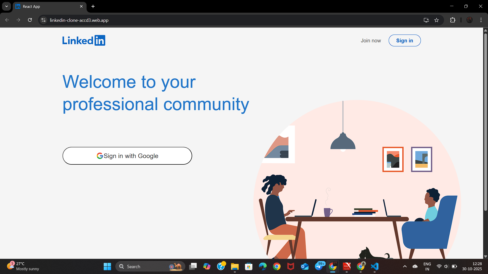

<h1 align="center">🔗 LinkedIn Clone</h1>
<p align="center">
  
  
  
  
  
</p>

<p align="center">
  A <b>modern LinkedIn Clone</b> built with <b>React.js</b>, <b>Firebase</b>, and <b>Redux</b>.<br/>
  Features user authentication, real-time posts, and a responsive professional feed — all powered by Firebase! 🔥💬
</p>

---

## 🚀 Live Demo
🔗 **View Project:** [🔗 LinkedIn Clone](https://linkedin-clone-accd3.web.app/)

📸 **Preview:**
<p align="center">
  
</p>

---

## 🧠 About the Project
The **LinkedIn Clone** is a web app inspired by the real LinkedIn platform — allowing users to sign in, post updates, and connect professionally.  
It focuses on **modern UI design**, **real-time updates**, and **smooth user experience** using React and Firebase.

### 🎯 Key Highlights:
- 🔐 Firebase Authentication (Google Sign-In / Email-Password)  
- 📰 Real-time post updates using Firestore  
- 💬 Post creation, display, and feed updates  
- 🧭 React Router navigation  
- ⚛️ State managed with Redux  
- 🎨 Styled Components for responsive design  
- ☁️ Hosted on Firebase  

---

## 🛠️ Tech Stack
| Category | Technologies |
|-----------|--------------|
| 🌐 **Frontend** | React.js (Hooks + Functional Components) |
| 🗃️ **State Management** | Redux Toolkit |
| 🔥 **Backend / Database** | Firebase Firestore |
| 🔑 **Authentication** | Firebase Auth |
| 🎨 **Styling** | Styled Components / CSS3 |
| ☁️ **Deployment** | Firebase Hosting |

---

## 📂 Project Structure

📦 linkedin-clone<br>
├── src/<br>
│ ├── components/ → Reusable UI Components<br>
│ ├── features/ → Redux Slices<br>
│ ├── firebase.js → Firebase Configuration<br>
│ ├── App.js → Main App Logic<br>
│ └── index.js → Entry Point<br>
└── public/ → Static Assets (icons, manifest, etc.)

---

## ⚙️ Installation & Setup

**Clone the Repository**
```bash
git clone https://github.com/saicharanjanagama/Linkedin-Clone-Reactjs.git
cd linkedin-clone-Reactjs
```

**🧩 Install Dependencies**
```bash
npm install
```

**🔥 Setup Firebase**
- Go to Firebase Console
- Create a new project
- Enable Authentication → (Google or Email/Password)
- Enable Firestore Database
- Create a file src/firebase.js and add your Firebase config:
```bash
const firebaseConfig = {
  apiKey: "YOUR_API_KEY",
  authDomain: "YOUR_AUTH_DOMAIN",
  projectId: "YOUR_PROJECT_ID",
  storageBucket: "YOUR_STORAGE_BUCKET",
  messagingSenderId: "YOUR_SENDER_ID",
  appId: "YOUR_APP_ID"
};
```

**⚙️ Initialize Firebase Hosting (First-Time Setup)**
If you haven’t connected Firebase Hosting yet, follow these steps in your terminal:
```bash
# Install Firebase CLI globally (if not installed)
npm install -g firebase-tools

# Login to Firebase account
firebase login

# Initialize Firebase project
firebase init
```
**When prompted:**
- Select Hosting and press Enter
- Choose Use existing project (select the project you created)
- Set the public directory to build
- Choose Yes for “Configure as a single-page app”
- Choose No for “Set up automatic builds and deploys with GitHub?” (optional)

**🚀 Run the App**
```bash
npm start
```

**☁️ Deploy to Firebase**
```bash
npm run build
firebase deploy
```

---

## 🎮 Usage

- Sign in using Google or Email 🔐
- Create a post with text and images 📝
- View posts instantly updated in the feed 🔄
- Explore professional UI and animations ✨
- Log out securely anytime 🚪

---

## ✨ Features

✅ Firebase Authentication (Google / Email)<br>
✅ Real-time Firestore Database updates<br>
✅ Redux state management<br>
✅ Responsive LinkedIn-like design<br>
✅ Styled Components theming<br>
✅ Secure Hosting on Firebase

---

## 💼 Developer Info

Sai Charan Janagama<br>
🎓 Computer Science Graduate | 🌐 Aspiring Full Stack Developer<br>
📧 [Email Me](saic89738@gmail.com) ↗<br>
🔗 [LinkedIn](https://www.linkedin.com/in/saicharanjanagama/) ↗<br>
💻 [GitHub](https://github.com/SaiCharanJanagama) ↗
